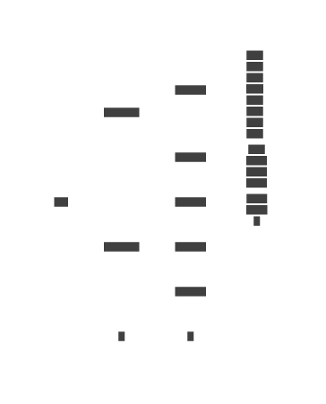

## nbvectors jjq command

A better name is needed for this tool, like jjqa or jsonalyze or something to distinguish it from
the base tool, since there are enhancements to it which are distinct. See below.

Basic documentation for this command is included in the CLI help. This readme is supplementary and
covers a broader ranges of topics than you need to just use jqq.

jjq is, at the very least, a way to use [jq](https://jqlang.org/) compatible syntax for processing
bulk JSON. It builds on [jackson-jq](https://github.com/eiiches/jackson-jq), which is a pure Java
implementation of the jq command and processing engine.

Where the jjq implementation differs is as follows:

- **bulk processing** - You can process large amounts of JSON in a multi-threaded harness by taking
  advantage of available cores.
- **data analysis** - You can analyze bulk JSON data to extract distributions, cardinality, or other
  schema or data-level information.
- **data transformation** - You can use this knowledge to transform bulk JSON data into other forms,
  such as flattening out a type system into ordinal values for a minimal test case.
- **extensions** - You can extend jq with more analysis and transformation capabilities by adding to
  this project.

Each of these is explained in more detail below under the respective headings.

## bulk processing

Since this toolkit was made to solve a test data problem, it needs to be able to work with very
large data sets suitable for scale and performance testing. While the jq command set provides a
convenient way of expressing queries for extracting or projecting JSON data, it is not packaged in a
way that allows for processing large datasets directly. The original jq command has support for some
streaming processing, but the jackson-jq library does not emulate this (yet?)

The jjq implementation solves this problem in two ways:

- Input is preferred in [jsonl](https://jsonlines.org/) format. This means that jjq is *always* in
  jq _slurp_ mode.
- Input jsonl files are efficiently chunked into regions called FilePartitions for concurrent
  processing.
  - This is not a full scan. Offsets are estimated and then newlines are found as dividing points.
  - The chunk sizes are forced to be small enough for memory-mapped IO, at a maximum chunk size of
    2_000_000_000 bytes.
- The file partitions are processed concurrently in smaller batches known as line chunks.
  - Each chunk is also consumed at a newline boundary based on a buffer sizing hint. A chunk will
    generally have several JSON objects to be processed together.
  - This avoids wasteful per-object processing and keeps threads busy doing more work and less
    synchronization.

As a user, you don't have to do anything to make this work. It does this automatically, spreading
line chunks over available cores.

## data analysis

The jackson-jq library supports extension at runtime. This allows us to add our own functions. These
functions can be used to analyze JSON objects as they flow through the evaluation context. This
allows you to do things like create inverted indexes of non-ordinal fields. The additional functions
will be described separately with built-in docs and a help option to list them out.

## data transformation

Along with the ability to analyze bulk JSON data, you can also use extended functions to transform a
JSON dataset. For example, you could use an inverted index from the data analysis phase to replace
an opaque identifier with an ordinal type. This is actually one of the key reasons that this tool
was built. It is crucial that user-provided datasets from real systems can be represented in their
simplest and most accessible form for testing. Removing domain types and opaque values from a data
set and replacing them with equivalent ordinal types which maintain relationships exactly is a way
to achieve this.

## extensions

Since this project is implemented in pure Java, any competent Java developer can add functions for
analysis or transformation.

## Caveats

Because of the way the data is multiplexed over cores for processing, it is not possible to use the
standard jq functions which do scans, grouping, or sorting on the data overall. This is considered a
reasonable trade-off, given that you can drop down to actual jq on the command line if you need for
intermediate steps.

