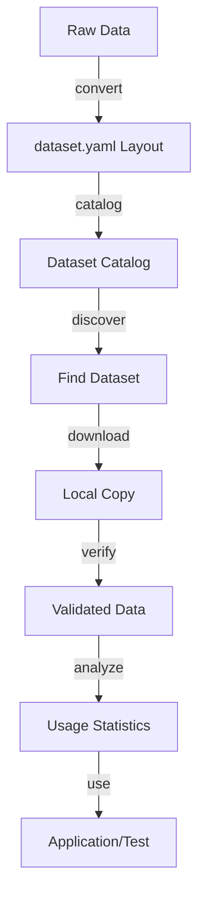

# Working with Datasets

This chapter provides practical workflows for common dataset management tasks using NBDataTools.

## Dataset Lifecycle



## Discovering Datasets

### List Available Datasets

Browse the catalog of available datasets:

```bash
java -jar nbvectors.jar datasets list
```

Output example:
```
Name                    Dimensions  Base Count   Distance     Size
glove-25-angular             25      1,183,514   angular      110MB
glove-50-angular             50      1,183,514   angular      220MB
sift-128-euclidean          128      1,000,000   euclidean    500MB
deep-image-96-angular        96      9,990,000   angular      3.5GB
```

### Filter Datasets

Find datasets matching specific criteria:

```bash
# Find small datasets
java -jar nbvectors.jar datasets list --filter "size < 100MB"

# Find high-dimensional datasets  
java -jar nbvectors.jar datasets list --filter "dimensions > 100"

# Find datasets with specific distance function
java -jar nbvectors.jar datasets list --filter "distance = euclidean"

# Multiple criteria
java -jar nbvectors.jar datasets list \
  --filter "dimensions = 128 AND distance = euclidean"
```

### Get Dataset Information

View detailed information about a specific dataset:

```bash
java -jar nbvectors.jar datasets info --name "sift-128-euclidean"
```

Output example:
```
Dataset: sift-128-euclidean
Description: SIFT features from natural images
License: Public Domain
Vendor: INRIA
Distance: euclidean
Dimensions: 128
Base vectors: 1,000,000
Query vectors: 10,000
Ground truth neighbors: 100
File size: 512MB
Download URL: https://example.com/datasets/sift-128-euclidean/
Checksum: sha256:abc123...
```

## Downloading Datasets

### Basic Download

Download a dataset to local storage:

```bash
java -jar nbvectors.jar datasets download \
  sift-128-euclidean:default \
  --output ./datasets/
```

The dataset will be materialized under `./datasets/sift-128-euclidean/` (manifest plus facets).

To target an alternate profile, change the part after the colon (for example `sift-128-euclidean:validation`). Escape literal colons in dataset names with `\:` such as `vector\:set:default`.

### Advanced Download Options

With verification and resume capability:

```bash
java -jar nbvectors.jar datasets download \
  deep-image-96-angular:default \
  --output ./datasets/ \
  --verify \
  --resume \
  --threads 4
```

Options explained:
- `--verify`: Check file integrity after download
- `--resume`: Resume interrupted downloads
- `--threads 4`: Use 4 parallel download threads

### Custom Location

Download with a custom filename:

```bash
java -jar nbvectors.jar datasets download \
  --name "glove-100-angular" \
  --output ./data/glove-100
```

## Converting Your Own Data

### Single Vector File

Convert a `.fvec` file to CSV:

```bash
java -jar nbvectors.jar convert file \
  --input my_vectors.fvec \
  --output my_vectors.csv \
  --dimensions 128
```

### Complete Test Dataset

Convert base vectors, queries, and ground truth into other formats:

```bash
java -jar nbvectors.jar convert file --input base_vectors.fvec --output base_vectors.json
java -jar nbvectors.jar convert file --input query_vectors.fvec --output query_vectors.csv
java -jar nbvectors.jar convert file --input ground_truth.ivec --output ground_truth.json
```

### From Parquet

Convert from Parquet format:

```bash
java -jar nbvectors.jar convert file \
  --input vectors.parquet \
  --output vectors.fvec \
  --parquet-column embedding \
  --parquet-id-column id
```

### Batch Conversion

Convert multiple files in a directory:

```bash
#!/bin/bash
for file in *.fvec; do
    base=$(basename "$file" .fvec)
    java -jar nbvectors.jar convert file \
      --input "$file" \
      --output "${base}.csv"
done
```

## Analyzing Datasets

### Dataset Overview

Get a high-level description:

```bash
java -jar nbvectors.jar analyze describe datasets/mteb-lite
```

Output example:
```
Dataset: datasets/mteb-lite
Format version: 1.0
Distance function: euclidean
Created: 2024-01-15T10:30:00Z

Base vectors:
  Count: 1,000,000
  Dimensions: 128  
  Data type: float32
  Size: 512MB

Query vectors:
  Count: 10,000
  Dimensions: 128
  Data type: float32
  Size: 5.1MB

Ground truth:
  Neighbors per query: 100
  Total entries: 1,000,000
  Size: 38.1MB
```

### Detailed Statistics

Get comprehensive statistics:

```bash
java -jar nbvectors.jar analyze describe \
  datasets/mteb-lite \
  --detailed \
  --format json
```

Example output:
```json
{
  "dataset": "datasets/mteb-lite",
  "version": "1.0",
  "distance": "euclidean",
  "base_vectors": {
    "count": 1000000,
    "dimensions": 128,
    "statistics": {
      "mean_norm": 12.45,
      "std_norm": 2.31,
      "min_value": -15.2,
      "max_value": 18.7,
      "zero_vectors": 0,
      "nan_vectors": 0
    }
  }
}
```

### Verify Ground Truth

Check that k-NN ground truth is correct:

```bash
java -jar nbvectors.jar analyze verify_knn datasets/mteb-lite \
  --sample-size 1000 \
  --k 10
```

This verifies that the stored neighbors are actually the nearest neighbors according to the distance function.

### Count Zero Vectors

Find empty or zero vectors:

```bash
java -jar nbvectors.jar analyze count_zeros --file vectors.fvec
```

Useful for data quality checking.

## Dataset Validation

### Structure Validation

Verify that a dataset directory follows the standard structure:

```bash
java -jar nbvectors.jar analyze describe datasets/mteb-lite --format json
```

### Data Consistency Checks

Check for common issues:

```bash
# Check dimensions match between base and query
java -jar nbvectors.jar analyze describe datasets/mteb-lite

# Verify ground truth dimensions
java -jar nbvectors.jar analyze verify_knn datasets/mteb-lite --k 1

# Check for data corruption on a specific facet
java -jar nbvectors.jar merkle verify \
  --file datasets/mteb-lite/base.fvec \
  --reference base.mref
```

## Working with Subsets

### Extract Subsets

Create smaller datasets for testing:

```bash
java -jar nbvectors.jar analyze select \
  --dataset datasets/mteb-lite \
  --output small_subset/ \
  --base-count 10000 \
  --query-count 1000 \
  --k 10
```

### Window-Based Access

Define data windows for cross-validation:

```json
{
  "windows": {
    "train": {
      "intervals": [
        {"start": 0, "end": 800000}
      ]
    },
    "test": {  
      "intervals": [
        {"start": 800000, "end": 1000000}
      ]
    }
  }
}
```

Apply window configuration:
```bash
java -jar nbvectors.jar analyze select \
  --dataset datasets/mteb-lite \
  --output train_set/ \
  --window-config windows.json \
  --window train
```

## Creating Dataset Catalogs

### Single Directory

Create a catalog of dataset directories:

```bash
java -jar nbvectors.jar catalog \
  --directories ./datasets \
  --basename catalog
```

### Recursive Scanning

Scan directories recursively and include stats/checksums:

```bash
java -jar nbvectors.jar catalog \
  --directories ./all_datasets \
  --recursive \
  --basename complete_catalog \
  --include-checksums \
  --include-statistics
```

## Metadata Management

### Inspect dataset.yaml

View manifest metadata directly:

```bash
cat datasets/mteb-lite/dataset.yaml
```

### Update Attributes

Modify attributes via standard YAML tools or scripts:

```bash
python3 - <<'PYDATA'
import yaml
from pathlib import Path
manifest = Path('datasets/mteb-lite/dataset.yaml')
data = yaml.safe_load(manifest.read_text())
data.setdefault('attributes', {})['license'] = 'CC-BY-4.0'
manifest.write_text(yaml.safe_dump(data))
PYDATA
```

### Query Metadata

Use `vectordata info` to extract specific fields:

```bash
java -jar nbvectors.jar vectordata info datasets/mteb-lite --property attributes.license
```

## Performance Optimization

### Preprocessing Large Facets

For very large facets, create Merkle references:

```bash
java -jar nbvectors.jar merkle create   --file datasets/mteb-lite/base.fvec   --output base.mref   --chunk-size 1MB
```

### Prebuffering Profiles

```bash
java -jar nbvectors.jar datasets prebuffer datasets/mteb-lite --profile default
```

### Parallel Conversions

```bash
java -jar nbvectors.jar convert file   --input huge_vectors.fvec   --output huge_vectors.csv   --parallel 8
```

## Quality Assurance Workflows

### Full Dataset Validation

```bash
#!/bin/bash
DATASET="datasets/mteb-lite"

java -jar nbvectors.jar analyze describe "$DATASET" --detailed
java -jar nbvectors.jar analyze verify_knn "$DATASET" --sample-size 100 --k 10
java -jar nbvectors.jar merkle create --file "$DATASET/base.fvec" --output base.mref
```

### Automated Testing

```bash
#!/bin/bash
for dataset in datasets/*/dataset.yaml; do
  dir=$(dirname "$dataset")
  echo "Testing $dir ..."
  if ! java -jar nbvectors.jar analyze describe "$dir" > /dev/null; then
    echo "ERROR: invalid dataset in $dir"; continue
  fi
  if ! java -jar nbvectors.jar analyze verify_knn "$dir" --sample-size 10 > /dev/null; then
    echo "WARNING: ground truth issues in $dir"
  fi
  echo "✓ $dir passed validation"
done
```

## Integration Examples

### With Python

Access vectordata facets from Python using NumPy:

```python
import numpy as np

def read_fvec(path):
    data = np.fromfile(path, dtype='<f4')
    dims = int.from_bytes(open(path, 'rb').read(4), 'little', signed=False)
    return data.reshape(-1, dims + 1)[:, 1:]

base_vectors = read_fvec('datasets/mteb-lite/base.fvec')
print(base_vectors.shape)
```

### With Spark

First convert a facet to Parquet, then load it:

```bash
java -jar nbvectors.jar convert file   --input datasets/mteb-lite/base.fvec   --output base.parquet
```

```scala
import org.apache.spark.sql.SparkSession
val spark = SparkSession.builder().appName("VectorAnalysis").getOrCreate()
val vectors = spark.read.parquet("base.parquet")
vectors.show()
```

## Troubleshooting Common Issues

### Facet Corruption

If you suspect corruption in a facet file:

```bash
java -jar nbvectors.jar merkle verify \
  --file datasets/mteb-lite/base.fvec \
  --reference base.mref
```

Re-download if needed:

```bash
java -jar nbvectors.jar datasets download dataset-name:default --output ./datasets/ --verify --force
```

### Dimension Mismatches

```bash
java -jar nbvectors.jar convert file   --input vectors.fvec   --output vectors.csv   --dimensions 128
```

### Memory Issues

```bash
java -Xmx16g -jar nbvectors.jar analyze describe datasets/mteb-lite
java -jar nbvectors.jar datasets prebuffer datasets/mteb-lite --profile default
```

## Best Practices

### 1. Always Validate

- Check file structure after conversion
- Verify ground truth when available
- Create integrity checksums

### 2. Include Metadata

- Document data source
- Record creation date
- Specify license terms
- Note any preprocessing steps

### 3. Test with Subsets

- Create small test datasets
- Validate workflows on subsets
- Use representative samples

### 4. Backup and Version

- Keep original raw data
- Version control your datasets
- Document changes and updates

### 5. Monitor Performance

- Profile memory usage
- Time operations
- Optimize chunk sizes

## Summary

This chapter covered practical workflows for:

- **Discovering** datasets from catalogs
- **Converting** between supported formats
- **Analyzing** dataset properties and quality
- **Validating** data integrity
- **Creating** and managing catalogs
- **Optimizing** performance for large datasets

These workflows form the foundation for effective vector dataset management in research and production environments.

Next: Learn about [API Programming](06-api-guide.md) for programmatic access to datasets.
