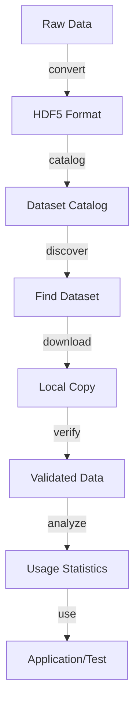

# Working with Datasets

This chapter provides practical workflows for common dataset management tasks using NBDataTools.

## Dataset Lifecycle



## Discovering Datasets

### List Available Datasets

Browse the catalog of available datasets:

```bash
java -jar nbvectors.jar datasets list
```

Output example:
```
Name                    Dimensions  Base Count   Distance     Size
glove-25-angular             25      1,183,514   angular      110MB
glove-50-angular             50      1,183,514   angular      220MB
sift-128-euclidean          128      1,000,000   euclidean    500MB
deep-image-96-angular        96      9,990,000   angular      3.5GB
```

### Filter Datasets

Find datasets matching specific criteria:

```bash
# Find small datasets
java -jar nbvectors.jar datasets list --filter "size < 100MB"

# Find high-dimensional datasets  
java -jar nbvectors.jar datasets list --filter "dimensions > 100"

# Find datasets with specific distance function
java -jar nbvectors.jar datasets list --filter "distance = euclidean"

# Multiple criteria
java -jar nbvectors.jar datasets list \
  --filter "dimensions = 128 AND distance = euclidean"
```

### Get Dataset Information

View detailed information about a specific dataset:

```bash
java -jar nbvectors.jar datasets info --name "sift-128-euclidean"
```

Output example:
```
Dataset: sift-128-euclidean
Description: SIFT features from natural images
License: Public Domain
Vendor: INRIA
Distance: euclidean
Dimensions: 128
Base vectors: 1,000,000
Query vectors: 10,000
Ground truth neighbors: 100
File size: 512MB
Download URL: https://example.com/datasets/sift-128-euclidean.hdf5
Checksum: sha256:abc123...
```

## Downloading Datasets

### Basic Download

Download a dataset to local storage:

```bash
java -jar nbvectors.jar datasets download \
  sift-128-euclidean:default \
  --output ./datasets/
```

The file will be saved as `./datasets/sift-128-euclidean.hdf5`.

To target an alternate profile, change the part after the colon (for example `sift-128-euclidean:validation`). Escape literal colons in dataset names with `\:` such as `vector\:set:default`.

### Advanced Download Options

With verification and resume capability:

```bash
java -jar nbvectors.jar datasets download \
  deep-image-96-angular:default \
  --output ./datasets/ \
  --verify \
  --resume \
  --threads 4
```

Options explained:
- `--verify`: Check file integrity after download
- `--resume`: Resume interrupted downloads
- `--threads 4`: Use 4 parallel download threads

### Custom Location

Download with a custom filename:

```bash
java -jar nbvectors.jar datasets download \
  --name "glove-100-angular" \
  --output ./data/my_glove_dataset.hdf5
```

## Converting Your Own Data

### Single Vector File

Convert a `.fvec` file to HDF5:

```bash
java -jar nbvectors.jar export_hdf5 \
  --input my_vectors.fvec \
  --output my_dataset.hdf5 \
  --dataset-name "my_embeddings" \
  --distance euclidean
```

### Complete Test Dataset

Convert base vectors, queries, and ground truth:

```bash
java -jar nbvectors.jar export_hdf5 \
  --input base_vectors.fvec \
  --queries query_vectors.fvec \
  --neighbors ground_truth.ivec \
  --distances ground_truth_distances.fvec \
  --output complete_dataset.hdf5 \
  --distance cosine \
  --dataset-name "my_ann_testset"
```

### From Parquet

Convert from Parquet format:

```bash
java -jar nbvectors.jar export_hdf5 \
  --input vectors.parquet \
  --output vectors.hdf5 \
  --parquet-vector-column "embedding" \
  --parquet-id-column "id"
```

### Batch Conversion

Convert multiple files in a directory:

```bash
#!/bin/bash
for file in *.fvec; do
    base=$(basename "$file" .fvec)
    java -jar nbvectors.jar export_hdf5 \
      --input "$file" \
      --output "${base}.hdf5" \
      --dataset-name "$base"
done
```

## Analyzing Datasets

### Dataset Overview

Get a high-level description:

```bash
java -jar nbvectors.jar analyze describe --file dataset.hdf5
```

Output example:
```
Dataset: dataset.hdf5
Format version: 1.0
Distance function: euclidean
Created: 2024-01-15T10:30:00Z

Base vectors:
  Count: 1,000,000
  Dimensions: 128  
  Data type: float32
  Size: 512MB

Query vectors:
  Count: 10,000
  Dimensions: 128
  Data type: float32
  Size: 5.1MB

Ground truth:
  Neighbors per query: 100
  Total entries: 1,000,000
  Size: 38.1MB
```

### Detailed Statistics

Get comprehensive statistics:

```bash
java -jar nbvectors.jar analyze describe \
  --file dataset.hdf5 \
  --detailed \
  --format json
```

Example output:
```json
{
  "file": "dataset.hdf5",
  "version": "1.0",
  "distance": "euclidean",
  "base_vectors": {
    "count": 1000000,
    "dimensions": 128,
    "statistics": {
      "mean_norm": 12.45,
      "std_norm": 2.31,
      "min_value": -15.2,
      "max_value": 18.7,
      "zero_vectors": 0,
      "nan_vectors": 0
    }
  }
}
```

### Verify Ground Truth

Check that k-NN ground truth is correct:

```bash
java -jar nbvectors.jar analyze verify_knn \
  --file dataset.hdf5 \
  --sample-size 1000 \
  --k 10
```

This verifies that the stored neighbors are actually the nearest neighbors according to the distance function.

### Count Zero Vectors

Find empty or zero vectors:

```bash
java -jar nbvectors.jar analyze count_zeros --file vectors.fvec
```

Useful for data quality checking.

## Dataset Validation

### Structure Validation

Verify that an HDF5 file follows the standard structure:

```bash
java -jar nbvectors.jar show_hdf5 \
  --file dataset.hdf5 \
  --tree \
  --attributes
```

### Data Consistency Checks

Check for common issues:

```bash
# Check dimensions match between base and query
java -jar nbvectors.jar analyze describe --file dataset.hdf5

# Verify ground truth dimensions
java -jar nbvectors.jar analyze verify_knn --file dataset.hdf5 --k 1

# Check for data corruption
java -jar nbvectors.jar merkle verify \
  --file dataset.hdf5 \
  --reference dataset.mref
```

## Working with Subsets

### Extract Subsets

Create smaller datasets for testing:

```bash
java -jar nbvectors.jar analyze select \
  --file large_dataset.hdf5 \
  --output small_dataset.hdf5 \
  --base-count 10000 \
  --query-count 1000 \
  --k 10
```

### Window-Based Access

Define data windows for cross-validation:

```json
{
  "windows": {
    "train": {
      "intervals": [
        {"start": 0, "end": 800000}
      ]
    },
    "test": {  
      "intervals": [
        {"start": 800000, "end": 1000000}
      ]
    }
  }
}
```

Apply window configuration:
```bash
java -jar nbvectors.jar analyze select \
  --file dataset.hdf5 \
  --output train_set.hdf5 \
  --window-config windows.json \
  --window train
```

## Creating Dataset Catalogs

### Single Directory

Create a catalog of all HDF5 files in a directory:

```bash
java -jar nbvectors.jar catalog_hdf5 \
  --directory ./datasets \
  --output catalog.json
```

### Recursive Scanning

Scan directories recursively:

```bash
java -jar nbvectors.jar catalog_hdf5 \
  --directory ./all_datasets \
  --output complete_catalog.json \
  --recursive \
  --pattern "*.hdf5"
```

### Custom Catalog Entry

Add metadata to catalog entries:

```bash
java -jar nbvectors.jar catalog_hdf5 \
  --directory ./datasets \
  --output catalog_with_metadata.json \
  --include-checksums \
  --include-statistics
```

## Metadata Management

### View Metadata

Show all attributes in an HDF5 file:

```bash
java -jar nbvectors.jar tag_hdf5 list --file dataset.hdf5
```

### Add Metadata

Add custom attributes:

```bash
# Add license information
java -jar nbvectors.jar tag_hdf5 write \
  --file dataset.hdf5 \
  --path / \
  --attribute license \
  --value "CC-BY-4.0"

# Add vendor information  
java -jar nbvectors.jar tag_hdf5 write \
  --file dataset.hdf5 \
  --path / \
  --attribute vendor \
  --value "Example University"

# Add creation date
java -jar nbvectors.jar tag_hdf5 write \
  --file dataset.hdf5 \
  --path / \
  --attribute created \
  --value "$(date -Iseconds)"
```

### Read Specific Metadata

Read individual attributes:

```bash
java -jar nbvectors.jar tag_hdf5 read \
  --file dataset.hdf5 \
  --path / \
  --attribute license
```

## Performance Optimization

### Preprocessing Large Files

For very large datasets, create merkle trees for integrity:

```bash
java -jar nbvectors.jar merkle create \
  --file huge_dataset.hdf5 \
  --output huge_dataset.mref \
  --chunk-size 1MB
```

### Chunked Processing

Process large files in chunks:

```bash
java -jar nbvectors.jar analyze describe \
  --file huge_dataset.hdf5 \
  --streaming \
  --chunk-size 100000
```

### Parallel Operations

Use multiple threads where supported:

```bash
java -jar nbvectors.jar export_hdf5 \
  --input huge_vectors.fvec \
  --output huge_vectors.hdf5 \
  --parallel 8 \
  --streaming
```

## Quality Assurance Workflows

### Full Dataset Validation

Complete validation pipeline:

```bash
#!/bin/bash
DATASET="my_dataset.hdf5"

echo "1. Checking file structure..."
java -jar nbvectors.jar show_hdf5 --file $DATASET --tree

echo "2. Analyzing dataset..."
java -jar nbvectors.jar analyze describe --file $DATASET --detailed

echo "3. Checking for zero vectors..."
java -jar nbvectors.jar analyze count_zeros --file $DATASET

echo "4. Verifying ground truth..."
java -jar nbvectors.jar analyze verify_knn --file $DATASET --sample-size 100

echo "5. Creating integrity signature..."
java -jar nbvectors.jar merkle create --file $DATASET --output ${DATASET%.hdf5}.mref

echo "Validation complete!"
```

### Automated Testing

Test script for multiple datasets:

```bash
#!/bin/bash
for dataset in datasets/*.hdf5; do
    echo "Testing $dataset..."
    
    # Quick validation
    if ! java -jar nbvectors.jar analyze describe --file "$dataset" > /dev/null; then
        echo "ERROR: Invalid dataset structure in $dataset"
        continue
    fi
    
    # Check ground truth if present
    if java -jar nbvectors.jar show_hdf5 --file "$dataset" --path /neighbors > /dev/null 2>&1; then
        if ! java -jar nbvectors.jar analyze verify_knn --file "$dataset" --sample-size 10 > /dev/null; then
            echo "WARNING: Ground truth issues in $dataset"
        fi
    fi
    
    echo "✓ $dataset passed validation"
done
```

## Integration Examples

### With Python

Access NBDataTools datasets from Python:

```python
import h5py
import numpy as np

# Load dataset
with h5py.File('dataset.hdf5', 'r') as f:
    base_vectors = f['/base/data'][:]
    query_vectors = f['/query/data'][:]
    neighbors = f['/neighbors/data'][:]
    
    # Get metadata
    distance_func = f.attrs['distance'].decode('utf-8')
    dimensions = f['/base'].attrs['dimensions']
    
    print(f"Loaded {len(base_vectors)} vectors of {dimensions}D")
    print(f"Distance function: {distance_func}")
```

### With Spark

Load data into Spark:

```scala
import org.apache.spark.sql.SparkSession

val spark = SparkSession.builder()
  .appName("VectorAnalysis")
  .getOrCreate()

// Convert HDF5 to Parquet first if needed
// java -jar nbvectors.jar export_parquet --input dataset.hdf5 --output dataset.parquet

val vectors = spark.read.parquet("dataset.parquet")
vectors.show()
```

## Troubleshooting Common Issues

### File Corruption

If you suspect file corruption:

```bash
# Check file integrity
java -jar nbvectors.jar merkle verify \
  --file dataset.hdf5 \
  --reference dataset.mref

# Re-download if needed
java -jar nbvectors.jar datasets download \
  --name "dataset-name" \
  --output ./datasets/ \
  --verify \
  --force
```

### Dimension Mismatches

When converting data with dimension issues:

```bash
# Explicitly specify dimensions
java -jar nbvectors.jar export_hdf5 \
  --input vectors.fvec \
  --output vectors.hdf5 \
  --dimensions 128 \
  --force-dimensions
```

### Memory Issues

For large datasets:

```bash
# Increase heap size
java -Xmx16g -jar nbvectors.jar analyze describe --file huge_dataset.hdf5

# Use streaming mode
java -jar nbvectors.jar analyze describe \
  --file huge_dataset.hdf5 \
  --streaming
```

## Best Practices

### 1. Always Validate

- Check file structure after conversion
- Verify ground truth when available
- Create integrity checksums

### 2. Include Metadata

- Document data source
- Record creation date
- Specify license terms
- Note any preprocessing steps

### 3. Test with Subsets

- Create small test datasets
- Validate workflows on subsets
- Use representative samples

### 4. Backup and Version

- Keep original raw data
- Version control your datasets
- Document changes and updates

### 5. Monitor Performance

- Profile memory usage
- Time operations
- Optimize chunk sizes

## Summary

This chapter covered practical workflows for:

- **Discovering** datasets from catalogs
- **Converting** various formats to HDF5
- **Analyzing** dataset properties and quality
- **Validating** data integrity
- **Creating** and managing catalogs
- **Optimizing** performance for large datasets

These workflows form the foundation for effective vector dataset management in research and production environments.

Next: Learn about [API Programming](06-api-guide.md) for programmatic access to datasets.
